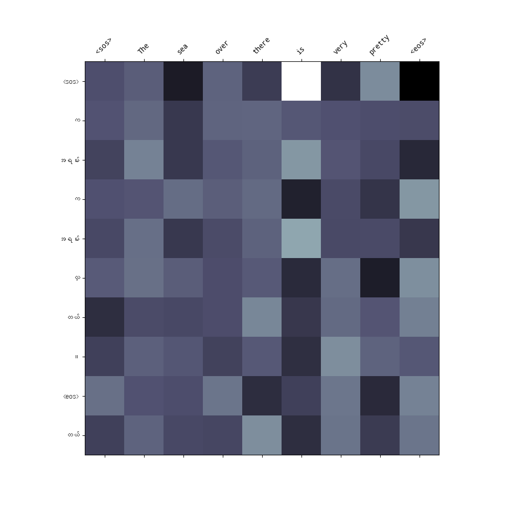
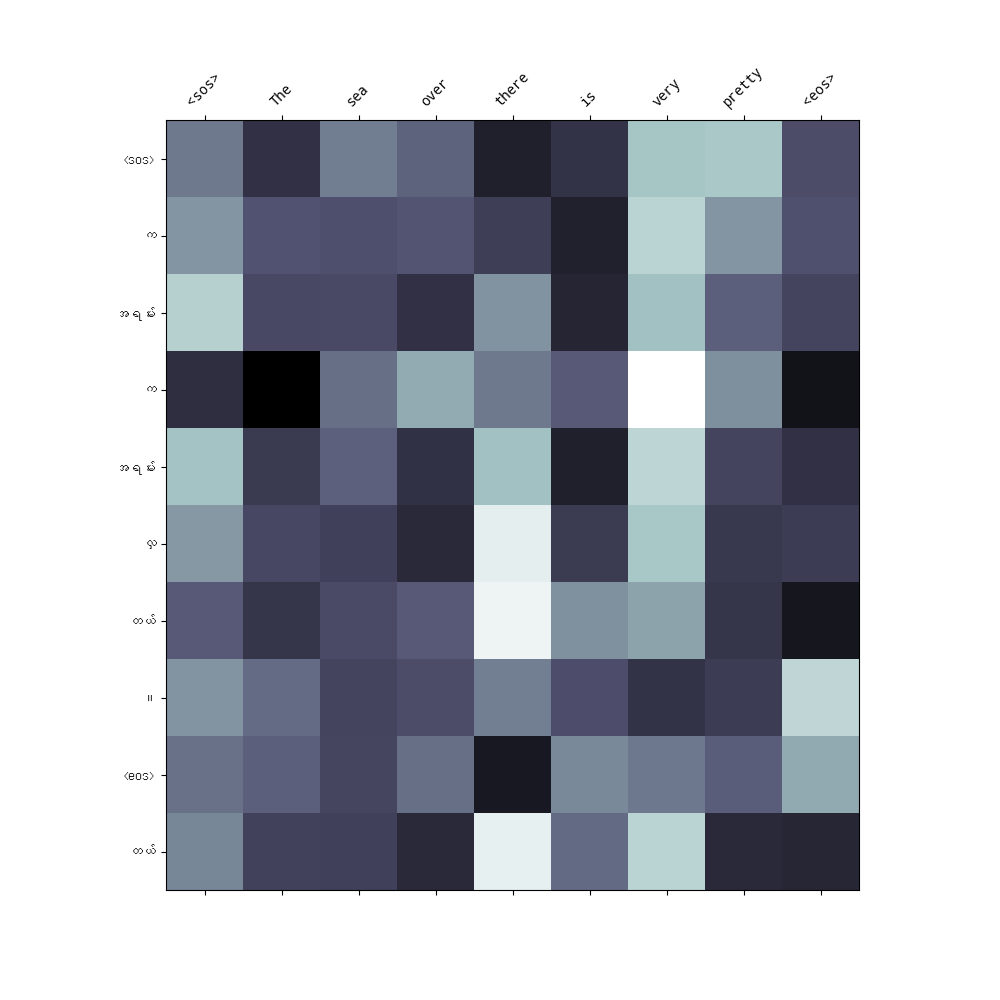
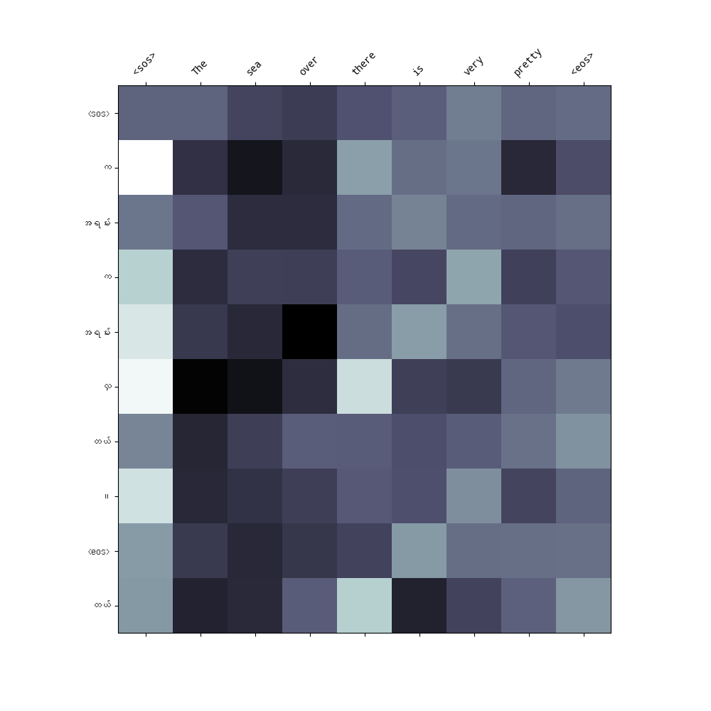

# nlp_a3

## Machine Translation 

In this assignment, neural machine translation is applied in translating between Myanmar and English. Experiments with different types of attention mechanisms, including general attention, multiplicative attention, and additive attention are performed and evaluated for
effectiveness in the translation process.

## Training Data

The TUFS Asian Language Parallel Corpus (TALPCo) is an open parallel corpus consisting of Japanese sentences and their translations into Korean, Burmese (Myanmar; the official language of the Republic of the Union of Myanmar), Malay (the national language of Malaysia, Singapore and Brunei), Indonesian, Thai, Vietnamese and English. TALPCo is licensed under a Creative Commons Attribution 4.0 International (CC BY 4.0) license. See the paper below for the details of TALPCo.

## Tokenizer for Myanmar Language

For tokenizing myanmar language, 𝗆𝔂𝕎◐ℝ𝗗 Segmentation Tool from https://github.com/ye-kyaw-thu/myWord is used.

## MultiHeadAttentionLayer

MultiHeadAttentionLayer is modified by adding a attribute "att_mechnism". This is to specify the attention mechanisms('gen','mul','add').

## Model configuration

    hid_dim = 256,
    enc_layers = 3,
    dec_layers = 3,
    enc_heads = 8,
    dec_heads = 8,
    enc_pf_dim = 512,
    dec_pf_dim = 512,
    enc_dropout = 0.1,
    dec_dropout = 0.1

## Training

    Epochs = 30,
    Learning rate = 0.001

## Model Comparison

| Attentions       | Training Loss | Training PPL | Validation Loss | Validation PPL | Training Time(s)
|------------------|---------------|--------------|-----------------|----------------|----------------|
| General       |       1.118786	     |       3.061137	        |      2.553121        |      12.847142	       | 568.960705 
| Multiplicative|         1.460821          |       4.309494	        |      2.437865	        |       11.448568	       | 570.225025
| Additive      |        1.540244	         |      4.665730	        |       2.489675	        |         12.057361	| 574.020139

## Learning Curves

| General Attention Loss   | Multiplicative Attention Loss  | Additive Attention Loss                                       |
|----------------------------------------------|----------------------------------------------|----------------------------------------------|
|  |  |  |

## Attention Map

| General Attention Map                                     | Multiplicative Attention Map                                      | Additive Attention Map                                       |
|----------------------------------------------|----------------------------------------------|----------------------------------------------|
|  |  |  | 

## Web Application

## Conclusion

In terms of training time, general attention got the best performance while multiplicative attention is slightly better in validation loss. However, the margins are relatively small. So, genreally, the attention mechanisms do not make a significant impact on perforamce and computaional complexity. This might be differnt for a larger corupus. Since the trained corpus is just around 1k sentences, the model training is just done under 10 epochs. It can be seen that the validation loss is not improving anymore beyond 10 epochs